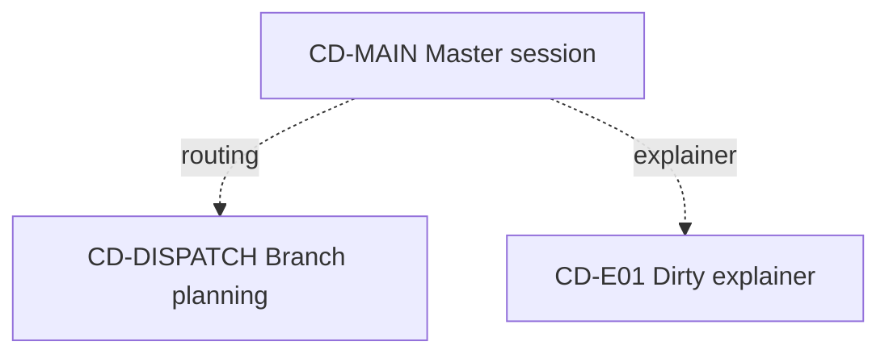

# Conductor Map: <project>

## Snapshot

- Snapshot id:
- Updated at:
- Mode: Ambient / Autopilot / Strict
- Master session:
- Dispatch session:
- Explainer sidecar:
- Active interactive branch limit: 2
- Current global goal:
- Current wave:

## Session Naming Rules

- Master: `[CD-MAIN][master] <project>`
- Dispatch: `[CD-DISPATCH][routing] Branch planning`
- Explainer: `[CD-E01][sidecar][explainer] Dirty questions`
- Branch: `[CD-001][W1][role] <short purpose>`
- Never put mutable status such as active/done/blocked in the session title.

## Today View

### Active Now

- ...

### Planned, Not Opened

- ...

### Blocked / Waiting

- ...

### Merge Pending

- ...

### Hard Gates Pending

- ...

## Wave Plan

| Wave | Branches | Prerequisites | Gate to unlock next wave |
| --- | --- | --- | --- |
| 0 | CD-MAIN | none | scope confirmed |

## Branch Registry

| Branch | Stable title | Type | Mode | Status | Wave | Depends on | Thread | Task dir | Return condition | Merge policy | Hard gate |
| --- | --- | --- | --- | --- | --- | --- | --- | --- | --- | --- | --- |
| CD-MAIN | `[CD-MAIN][master] <project>` | master | Autopilot | active | 0 | none |  |  | project control | short summaries only | none |
| CD-DISPATCH | `[CD-DISPATCH][routing] Branch planning` | dispatch | Autopilot | optional | sidecar | none |  | none | dispatch decision ready | final decisions only | conflicts/scope |
| CD-E01 | `[CD-E01][sidecar][explainer] Dirty questions` | explainer | Autopilot | active | sidecar | none |  | none | question answered | no merge by default | raw-history merge |

## Visualization

## Proposed Global Decisions

- ...

## Staleness Warnings

- ...

## Default Merge Budget

- Master receives `Suggested Merge Note` only unless audit/debug or another hard gate requires more.

## Next Recommended Step

- ...
